# 1. 舰船与装备详细知识扫盲

> by ChuangShi FlintyGHost

## 前言

EVE 当中最离不开的话题就是舰船以及舰船上的装备，每一种舰船以及每一种装备都有着自己独特的用处。本文将由浅入深向各位萌新介绍舰船以及装备的相关知识。各位萌新可以仔细阅读一遍，也可以把本文作为一个手册，根据的目录随时查阅你需要了解的部分。

## 第一部分 舰船属性

### 前言

EVE 当中的舰船有很多种，一般来说我们根据用途可以分为两类——作战舰船以及非作战舰船，作战舰船顾名思义就是那些具有攻击能力的舰船，而非作战舰船一般都是指矿船、货船、穿梭机等；而如果根据吨位来分的话，可以分为非常多的种类，包括护卫舰、驱逐舰、巡洋舰、战巡、战列、旗舰、工业舰等等。游戏里所有玩家可以操控的舰船都可以通过舰船树形图来查询。每一种舰船都有着对应的 T2 舰船，也就是高级舰船，个别级别舰船还会存在 T3 级别的衍生型号。本章节将以吨位，或者说是舰船等级来介绍四大种族各类舰船的通用特点，而势力舰船由于与普通舰船类似（通过类比下文中出现的舰船的方法可以了解他们的特点及作用）、三神裔舰船在早期又不推荐萌新使用，因而不做讲解。

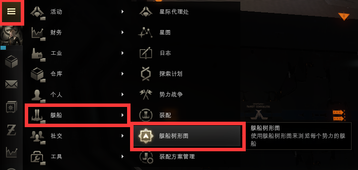

### 一、护卫舰

* T1 护卫舰 

护卫舰是所有萌新一上来就会接触到的舰船，同时也是相对来说吨位最低的作战舰船。四大帝国分别拥有 6 种不同类型的护卫舰。其中，四大帝国的护卫舰实际上分别对应了六种不同的舰船类型——即重火力、突击、扫描考古、特种作战、后勤以及高速截击，这从他们的船体加成的不同上就能够看的出来。CCP 之所以这么设计其实也是为了照顾萌新，希望萌新能够在一开始就去尝试不同用途的舰船。

加达里共和国的舰船为例，茶隼级的加成均与武器有关：前者增加伤害，后者增加射程，因而是重火力型；小鹰级则是伤害与护盾抗性加成，因此是突击型；苍鹭级是探针、打捞装置以及分析仪加成，因而是扫描考古型；矮脚鸡级是远程护盾回充相关加成，因而是后勤型；秃鹫级虽然是伤害加成，但是其特有加成为推进抑制系统启动消耗减少，也就是跃迁扰断、扰频以及停滞光束的耗电量降低，因而是高速截击型；而最后一种狮鹫级则是 ECM 加成，也就是目标锁定干扰系统加成，毫无疑问是特种作战型。

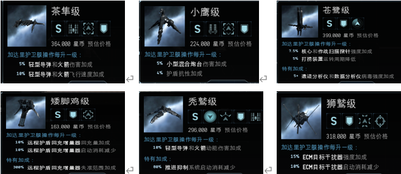

* T2 护卫舰 

护卫舰的 T2 级别是使用最多的护卫舰，包括突击护卫舰、隐形特勤舰、后勤护卫舰、截击舰以及电子攻击舰，这 5 种分别对应除重火力外的另外 5 种 T1 护卫舰，从舰船模型的相似上就可以明显看的出来。而在这些 T2 护卫舰中，最常用的主要是突击护卫舰以及截击舰，前者具有相对于护卫舰来说最强的防护能力（可以装备突击型损伤控制，该装备能够在短时间内极大幅度提高船体防御能力）；而后者则拥有最高的机动性，并且由于他的特殊加成是推进阻扰系统启动消耗降低，加之每一个帝国的截击舰都有两种型号，其中一种是可以无视跃迁拦截弹、跃迁拦截立场以及固定式跃迁扰断器的（也就是无视各种泡泡的），**因而截击舰是最适合用于充当斥候侦察、抓人、以及长距离跑路的舰船。**

### 二、驱逐舰

* T1 驱逐舰 

T1 级别的驱逐舰每个帝国各有两种，目前四大帝国的 T1 驱逐舰使用的频率非常低，主要是由于其不上不下的定位导致的——既没有护卫舰的机动能力和特殊加成，也没有巡洋舰的防御能力和泛用性。其特点一般都是高槽较多，但是其他槽位堪忧，因而经常被萌新拿来当打捞船用（促进：别骂了别骂了，我去捞还不行吗？）。

* T2 驱逐舰 

但是，和 T1 驱逐舰相比，T2、T3 的驱逐舰使用频率非常高。其中 T2 驱逐舰主要分为指挥驱逐舰与拦截舰（轻拦）。 

指挥驱逐舰最大的特点是可以装备跃迁立场发生器（群体跳刀），在开启之后他会使自己以及周围的舰船全部向前方瞬移 100KM，这也就意味着不管是带队友贴近距离自己超过 100KM 但又不足 150KM 的敌人，还是将一部分敌人送到自己友军身边都成为了可能，因此指挥驱逐舰是一种能够产生奇效的船只。 

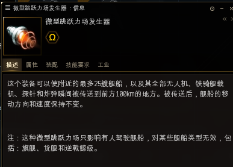

而拦截舰，又叫轻拦，则是作战时必不可少的舰船。其最大的特点就是可以装备拦截弹发射器，能够在自身位置发射一个拦截弹（也就是泡泡），在 2 分钟内使得以拦截弹为圆心半径 20KM 内的舰船无法跃迁，旗舰也不能开启跳跃引擎。这使得拦截舰成为了无论是防止敌方逃跑，还是减缓敌方追击速度的首选。

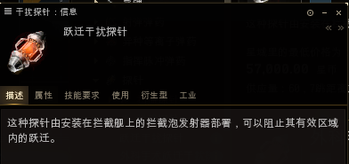

* T3 驱逐舰 

而 T3 级别的驱逐舰是战术驱逐舰，又名 T3D，则是一种非常灵活的小型舰船。其最大的特点是可以在三种模式下来回切换——狙击模式下提高伤害和射程、高速模式下提高舰船机动性、防御模式下则会增加舰船防御能力。因此这种舰船也经常被许多 PVP 爱好者拿来作为单人作战或者小队战的舰船。

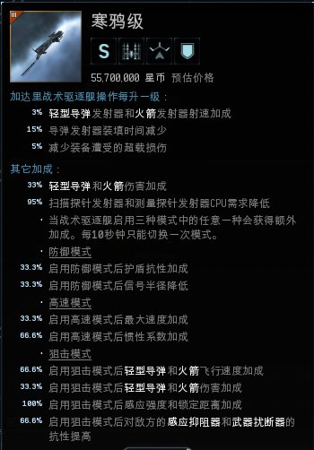

### 三、巡洋舰

* T1 巡洋舰 

巡洋舰是目前使用最广泛的舰船，四大帝国各有四种不同类型的巡洋舰。和护卫舰类似，T1 巡洋舰也分为重火力、突击、后勤、特种作战四大类，这里可以类比之前的护卫舰，同样以加达里为例：狞獾级为重火力型、鱼鹰级为后勤型、巨鸟级为突击型、黑鸟级为特种作战型。巡洋舰最大的特点就是火力中等、机动性好且具有一定的防护能力，加之 T1 巡洋舰价格并不贵，因此是萌新参加各类 PVP 时的首选船只（炸了不心疼，不管是你还是军团管补损的）。

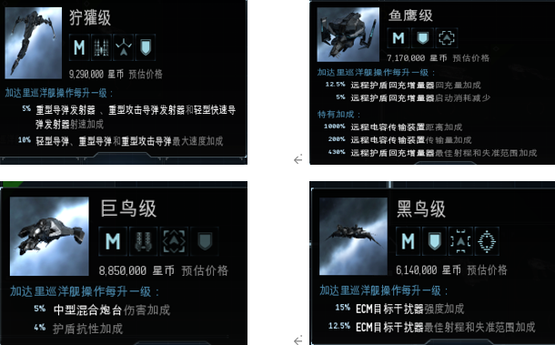

* T2 巡洋舰 

T2 巡洋舰主要分为四类，同样对应四种不同的 T1 巡洋舰，包括重型突击巡洋舰、重型拦截巡洋舰（重拦）、侦察舰、后勤舰，是目前最广泛使用的常规战舰。 

重型突击巡洋舰的特点就是火力猛、防护能力好（同样可以装备突击型损伤控制）。无论是目前联盟常用的缪宁（M 族）、银鹰（C 族）、狂热（A 族），还是在 PVE 上经常使用的伊什塔（G 族），几乎每一种重突都具有自己的特点和用武之地（戴莫斯：放屁咧！你们从来不带我出去玩！就知道嫌弃我手短！）。

后勤舰不用多说，是常规舰队里必不可少的舰船，**没有后勤舰的话再多的火力船也只不过是慢性死亡**（你要是开后勤，你看那群火力船不得喊你叫爸爸？啥？不喊？那打起来你自己喝热水吧！）。

重型拦截巡洋舰则是一种非常特殊的舰船，它最大的特点就是可以携带跃迁立场发生器，与轻拦不同，这种发生器开启后产生的泡泡会随着重拦的移动而移动，也就是以重拦为圆心。同时更为特殊的一点在于，这种立场发生器可以通过装填脚本的方式，使得跃迁干扰效果仅对某一个目标起效。要注意的是，一旦被使用脚本的重拦套上立场，那么战斗类的旗舰（货舰、战略货舰以及旗舰级工业舰除外的旗舰）不仅不能够跃迁、开启微曲，而且无法通过星门。因而重拦平常的使用不多，但是在面对旗舰、尤其是落单的旗舰的时候，他的威胁远超轻拦。

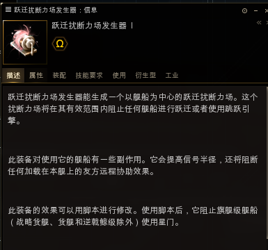

侦察舰则是一种非常特殊的舰船，四大帝国的侦察舰都分为两种——一种是无法通过舰载扫描（五度扫描）侦察到的，而另一种则是可以携带隐秘行动和诱导力场的隐身船。一般来说前者（即战斗侦察舰）被用来作为特种作战船只，而且经常担负抓人的任务——尤其是抓那些打死亡的，因为你除非在死亡空间入口的轨道处放置眼睛号，不然的话即使他进入轨道你也不知道。而且这类舰船中特别像是 G 族的拉克希斯级，其加成是跃迁扰断器和跃迁扰频器距离加成，因此特别适合抓人（七八十公里的反跳了解一下？）；而 M 族的休津级则拥有着离谱的停滞光束距离加成（几十公里远的网子你怕不怕？）。而另一种可以携带隐秘行动的侦察舰（力场侦察舰），一般除了用作特种船或者开隐身抓人之外，最主要的功能是携带诱导力场，这样子不管是让友军旗舰进场作战还是让自己的旗舰跑路，都是非常重要的（一支穿云箭，千军万马来相见！你等着我一会叫超旗过来打你！）。

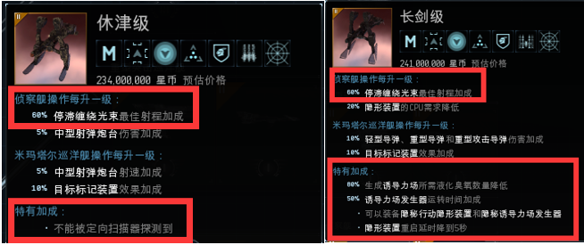

* T3 巡洋舰 

T3 级别的巡洋舰是战略巡洋舰，又叫 T3C，这是整个 EVE 里最特别的一种舰船。他最大的特点就是模块化设计，每一条船都分为 4 个子系统，每一个子系统都有 3 种不同加成和槽位的模块，你可以通过自由组合的方式为你的战略巡洋舰选择 4 个模块，然后再在上面去装配你所需的舰船装备。而且，部分模块甚至拥有让你装备隐秘行动装置或者是无视泡泡（也就是截击舰的那个特性）的能力，同时船体本身是可以随时更换改装件（船插）的，改装件不会因为卸载而损毁。因而这种船非常受到大家的欢迎。 

但是，这种船的缺点也很明显——首先，船体的加成实际上是由子系统决定的，子系统每一级的加成非常高，因此这艘船如果要发挥出真正的威力，那么必须要 4 个子系统的技能全部满级；同时，船体本身以及子系统价格相对来说非常昂贵，一艘全装的 T3 巡洋舰达到接近甚至超过 10E 的价格是非常正常的；此外，最重要的一点是，如果船爆了，不仅船没了，驾驶员还会随机丢失一级子系统技能，如果连着爆 T3 巡洋舰，你很可能会某个子系统变回 0 级，需要回炉重造，因而这种船非常不推荐萌新使用。

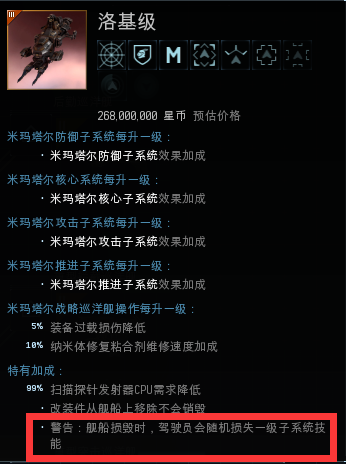

### 四、战列巡洋舰

* T1 战列巡洋舰 

T1 战列巡洋舰的用途与 T1 巡洋舰类似，只不过它牺牲了自己的机动性换取了相对更高的防御力和攻击力。每个帝国都有三种不同的 T1 战巡，分别偏向于防御、攻击和均衡。要注意的一点是，四大帝国的战巡当中分别有一种是攻击战列巡洋舰，其特点就是可以装备大型炮台——也就是战列级别的武器。这种战巡一般都是放弃防御，利用射程优势进行远距离重火力输出，其中最典型的就是常年在吉他等高安地区进行强暴作业的龙卷风级（龙卷风：食我 1400 大 X 啦！），当然另外三族塔洛斯级、娜迦级以及预言级的火力以及射程同样不容小视。

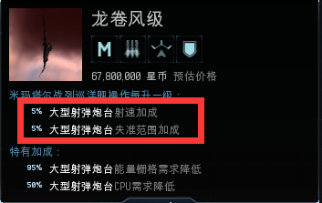

* T2 战列巡洋舰 

T2 战巡只有一种船，就是指挥舰。这种船一般是由舰队指挥使用作为走位船，其主要的特点就是加成——通过装配发射不同的加成发射器和加成弹药，为一定范围内的舰队成员提供属性加成，属于不会有很多人用但是又不能没有的船。对于萌新来说就不用考虑这种船了。

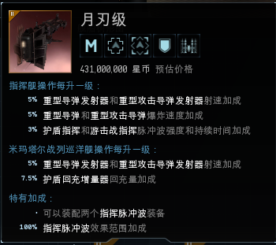

### 五、战列舰

* T1 战列舰 

战列舰是常规舰船中最大吨位的战舰，每个帝国都拥有 3 艘 T1 级别的战列舰，目前的话战列舰的用途不是很广，但是在小规模战斗中，战列舰往往能起到决定战局的作用。

四大帝国分别各拥有 3 种不同的战列舰，但这里存在一定的区别：AC 两族的战列舰可分为：远炮重火力（乌鸦级和灾难级）、近炮高防御（鲲鹏级和地狱天使级）以及特种作战（ECM 加成的毒蝎级和毁电吸电加成的末日沙场级）；而 GM 两族的战列舰则可以分为：自修型（修甲加成的亥伯龙神级和修盾加成的死亡漩涡级）、高射速重火力型（万王宝座级和狂暴级）以及其他类型（以无人机为主武器的多米尼克斯级和以导弹为主武器的台风级）。

因此，战列舰的专用性实际上更高，因此每种不同的战列舰都有着不同的玩法，需要区别对待。

* T2 战列舰

目前 T2 战列舰有两种：掠夺舰和黑隐特勤舰。

对于掠夺舰来说，4 族的掠夺舰都拥有对应的修量加成（C 和 M 是修盾加成，A 和 G 则是修甲加成），同时拥有非常高的武器伤害加成。同时，掠夺舰最特殊的一点在于：它可以装备堡垒模块。这是一种类似于无畏舰上使用的会战模块的装备，开启后将无法移动、跃迁、驻留或者停靠；同时无法接受传电和遥修。当然了，这样巨大的代价换来的就是强大的防御力（抗性提升、不受 ECM 影响、修量大幅度加成）以及更远的射程（武器射程加成）。

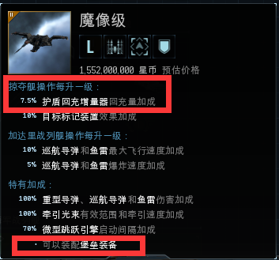

掠夺舰由于模块的特性，因此并不适合 PVP 作战（虽然无畏舰也有模块，但是无畏毕竟是旗舰，其伤害、血量、抗性、电量都是掠夺舰无法比拟的）。不少人会使用他在高安区做高等级的军事任务，但是在低安区和 00 地区，由于敌对收割力度大，掠夺舰不管是刷怪还是做任务都存在巨大风险（模块不是想关立马就能关的，必须得等这一轮转完），因此掠夺舰实际上用处并不是很大。

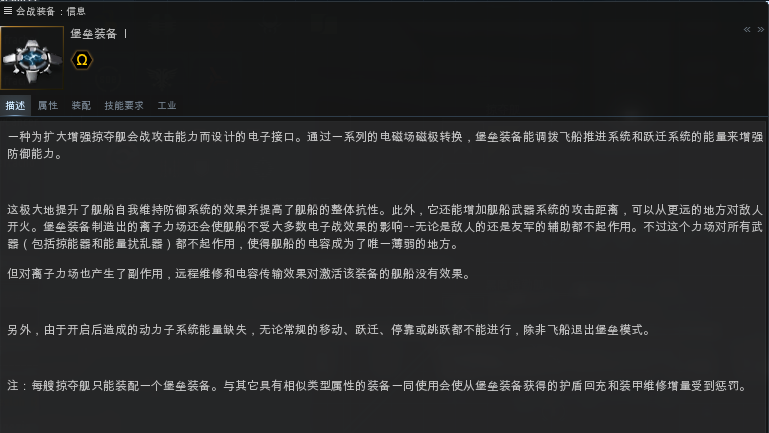

而黑隐特勤舰是非常非常特殊的一类战舰，这种庞大的战列舰能够装备隐身装置——注意，是普通的隐身装置不是 T2 级别的隐秘行动，并且启动隐身装置之后舰船的速度不仅没有被降低，甚至变得更快了，而且能够进行隐身跃迁。除此之外，黑隐特勤舰和隐形轰炸舰一样，隐身装置重启延迟很短且解除隐身之后立刻就能够进行锁定。

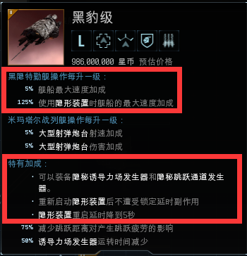

同时，黑隐特勤舰能够进行旗舰跳，并且可以装备隐秘诱导力场发生器以及隐秘跳跃通道发生器，这里简单介绍一下这两个装备。

隐秘诱导力场发生器简称黑诱导，他和普通的诱导不同之处在于他无法被侦测到，且只能由黑隐特勤舰锁定并进行旗舰跳或者投送；而隐秘跳跃通道发生器与泰坦上使用的投送装置类似，可以将同一个舰队的舰船投送到隐秘诱导所在的位置——当然，只能投送黑隐特勤舰以及其他能够装备隐秘行动隐身装置的舰船。

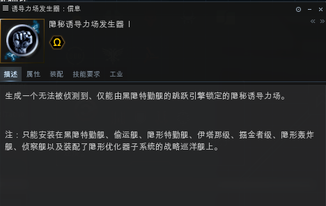

## 第二部分 武器系统

### 前言

第一部分我们讲解了常规舰船的一些特性，那么接下来的第二部分我们就首先来讲解战斗舰船的核心——武器系统。

目前，EVE 的常用武器系统主要分为两类：一种是炮台与发射器；另一种则是无人机。（立体炸弹并不算很常用，因此本文暂时不进行讨论）。而其中最常用的仍然是炮台与发射器——也就是能量炮、混合炮、射弹炮、导弹发射器以及熵能分解者，而这五种类型的武器实际上又能合并成两类——即炮类和导弹类。

注意：由于熵能分解者属于三神裔独有的武器系统，虽然同属炮类但是与另外三种有巨大的差异，且萌新不会很早接触这种武器及舰船，因此本文不过多做讲解，萌新们只需要知道这种武器对一个目标攻击时间越长，伤害越高即可。

### 一、 炮类

首先我们来讲讲传统的三种炮台——能量炮、混合炮、射弹炮。

这三种炮类实际上都分为近炮和远炮，近炮包括脉冲激光炮、疾速炮和自动加农炮其特点是射程相对较近但发射间隔短；而远炮则包括集束激光炮、磁轨炮和加农火炮，其特点则正好与近炮相反。这里可能很多萌新就要问了——那到底是远炮好还是近炮好？这里就要引出一个概念——炮台跟踪速度。

所谓炮台跟踪速度，实际上就是炮台的转速，炮台的转速没有目标相对于你的角速度大，那么就会导致你的炮台永远都落后目标，自然你也就打不中目标或者仅仅是擦过。**一般来说，对于同级别的不同种炮台，近炮的炮台跟踪速度要大于远炮的跟踪速度**。这也就意味着近炮更适合对抗高速目标，而远炮更适合对抗低速目标；而对于不同级别的同种炮台，小型炮台的跟踪速度要大于大型炮台的跟踪速度，也就是说护卫、驱逐上使用的炮台要比战巡、战列上使用的炮台更适合对抗高速目标。

那么这时候又有同学可能要问了：难道远炮就只能打站着不动的？跑得快的我难道一点办法也没有？ 

并不！

虽然炮台的转速有上限，但是你可以通过降低目标相对于你的角速度，从而达到一发入魂的目的。而降低目标角速度的方法也很简单——上网子（扰频）、炮辅装备、拉开距离。

上网子（扰频）的目的就是让对方的船速尽可能慢下来（网子降低对方船速、扰频关闭对方微曲），这一招对于贴在你脸上的高速目标非常有效；而炮辅装备更是直接增加你的炮台属性。但如果对方离你还有一段距离或者你没带上述两类装备时，最好的办法还是拉开距离，尤其是当你是堵门或者抓人等这种处在先手位置的时候。拉开距离虽然不会改变目标的船速，但是会降低目标相对于你的角速度——角速度=线速度/半径，当角速度不变，半径（距离）变大时，角速度变小（什么？？？这一段没看懂？？？那你还不滚去好好学习？？？马上要高考了啊喂！！！）。

但这里要特别注意两点：

第一，你如果自己开了个远炮小船然后高速环绕别人，你一样会打不中别人的！毕竟角速度是相对的！你的炮台也要转圈的！

第二，远炮不是说越远越好，炮类武器的最大射程都是由最佳射程和失准射程两部分组成，当你的距离超过最佳射程以后，炮类武器的伤害会随着距离的增加而衰减，**因此尽量不要卡着最大射程打，尤其是磁轨炮**。

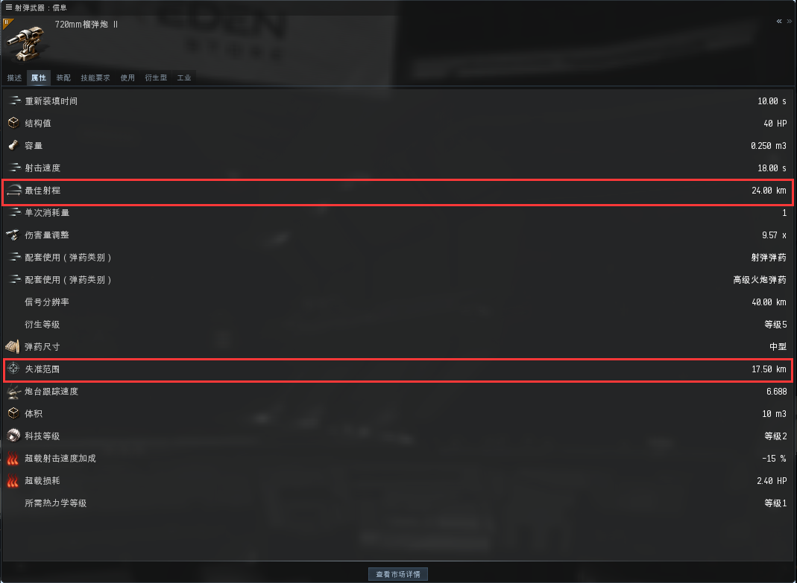

### 二、 导弹类

导弹和炮类最大的区别就在于，导弹是跟踪的，没打中这种情况非常少见。但是导弹的伤害高低却有另一套系统来判断，因此这里简单介绍一下导弹类的特点。

导弹主要分为三类——小型导弹（轻导和火箭）、中型导弹（重导和重攻导）和大型导弹（巡航导弹和鱼雷）。所有的导弹都包含以下几个非常关键的属性：最大飞行时间、最大飞行速度、爆炸速度、爆炸半径。

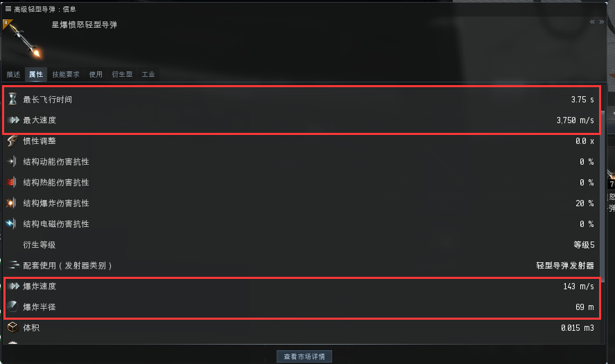

最大飞行时间和最大飞行速度是导弹本身的属性，前者决定导弹能飞多久、后者决定导弹的速度、两者共同决定导弹的射程（如果你连速度 X 时间=路程都不知道那我真无话可说）。

而爆炸速度和爆炸半径则是影响导弹伤害的两个属性，这里必须要引出两个舰船本身的属性——舰船速度和信号半径。

舰船速度没啥好说的，就是航速。而信号半径简单来说就是船只的体积——CCP 为了简化计算的方式，将游戏内的几乎所有实体全部当做一个球体来看待，并用这个球体的体积来表示实体的大小，而这个球体的半径即为信号半径。

同时，CCP 为了简化计算方式，他们将导弹的总伤害量定义为另一个球体，而这个球体的半径正是导弹的爆炸半径，每种导弹的爆炸半径各不相同，其中**鱼雷&gt;巡航导弹&gt;重型导弹&gt;重型攻击导弹&gt;轻型导弹&gt;火箭**。导弹的总伤害被均摊在这整个球体中，而代表船体大小的那个球体在代表导弹伤害的那个球体里，与之重叠的部分即为导弹的实际伤害量。简单点说就是，以同一个圆心画两个不同半径的圆，一个圆的半径是信号半径、另一个则是导弹爆炸半径，那么两个圆重叠的部分则为导弹的实际伤害量（即下图中红色部分为实际伤害量，空白部分所代表的伤害量被浪费了）

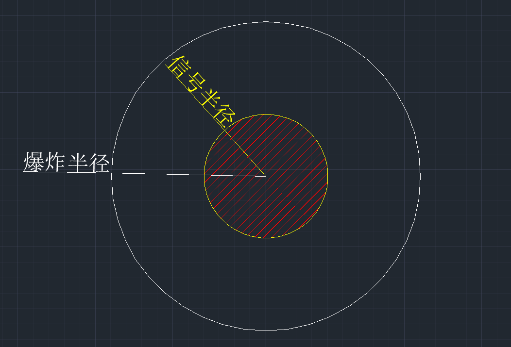

也就是说，**信号半径一定时，导弹爆炸半径越大，伤害越低；爆炸半径一定时，信号半径越小伤害越低**。这也就是为什么用重导甚至鱼雷、巡航导弹打护卫舰、驱逐舰的时候会伤害低到怀疑人生。

这里要注意一点：任何舰船开启微曲（微型跃迁推进器）的时候信号半径会急剧增大（变成原来的 5 倍），**所以如果有人拿鱼雷打你甚至是隐轰投炸弹来炸你，一定不要开启你的微曲！！！！！**

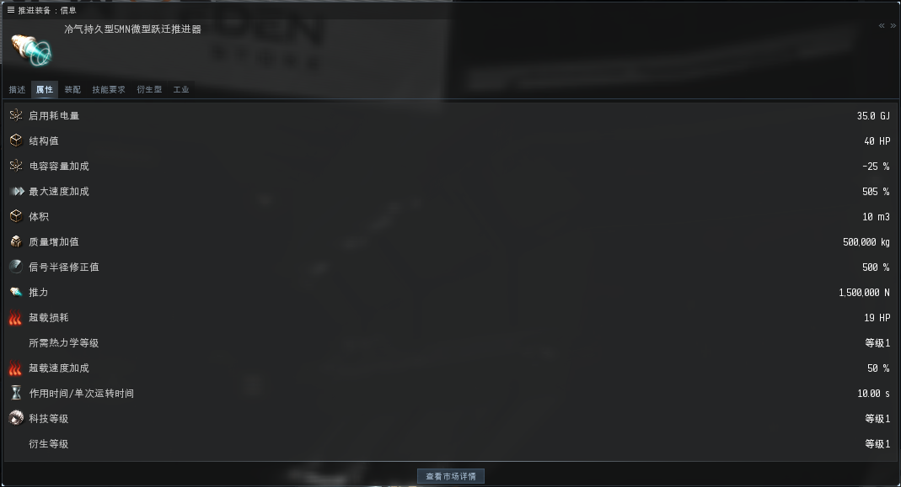

说完了爆炸半径，还剩一个爆炸速度。爆炸速度可以类比现实生活中冲击波的速度，在 EVE 里不同导弹的爆炸速度也是不同的，其中**巡航导弹&lt;鱼雷&lt;重型导弹&lt;重型攻击导弹&lt;火箭&lt;轻型导弹**（注意跟上面爆炸半径不是完全相反的顺序），**而当爆炸速度小于目标航速的时候，导弹伤害就会降低**（只要我跑的够快，冲击波就追不上我）；**而当爆炸速度大于目标航速的时候，导弹的伤害就会达到最大**。 

综上所述，**当目标信号半径越大、导弹爆炸半径越小、导弹爆炸速度越大时，导弹的伤害才能越来越高直至达到满伤害**。因此在实战中，大家一般选用小型导弹去打高速的小型目标；使用中型或者大型导弹来攻击低速的大型目标。当然，和炮类一样，你可以通过配备目标标记装备（增加目标信号半径）、给目标上网子（降低目标航速）以及装备导弹导引装备（增加导弹属性）来让你的导弹伤害更高。

### 三、 无人机类

无人机是一种非常特殊的武器类型。战斗用的无人机一般可以分为三类：攻击无人机、电子战无人机以及后勤无人机。而这些无人机都根据各自的功能被分为了轻型、中型和重型，而这三种等级的无人机除了他们的属性差距之外，最明显的差距就是无人机带宽的占用大小。

一般来说，满技能的舰船理论上都是可以最多操控 5 架无人机，但是，真正影响操控数量的实际上是无人机带宽的大小。举个典型的例子：毒蜥按道理是应该能用 5 架无人机的，但是他的带宽只有 20，而加成又是中型无人机，中型无人机 1 架需要 10 的带宽，因此毒蜥实际上只有 2 个中型无人机可以同时作战。

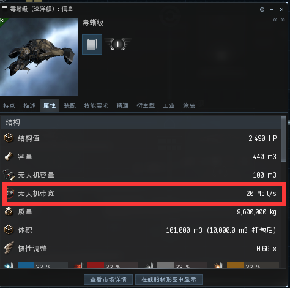

因此，无人机舰船在使用时，最重要的就是选择适合自己舰船的无人机——这个一方面要从舰船本身的加成考虑（比如毒蜥的加成就是中型，2 架中型无人机的火力远超 4 架轻型无人机），另一方面要考虑带宽的大小（多米尼克斯 125 的带宽，不搞 5 个重型无人机肯定是达不到最大效率的）。

那么这里可能会有同学要问：那如果带宽允许，岂不是带重型就一定最划算？

这里要注意：无人机也是有跟踪速度的。这和炮台的转速类似，如果无人机的跟踪速度过低的话，无人机也会出现打不中的情况（如果你拿多米或者伊什塔刷怪的话你就会知道，重无打护卫怪非常容易打不中）；而且无人机本身也有最佳射程，如果对方跑的太快，无人机追不上的话同样没法攻击；除此之外，无人机自身是有血量的，碰到对方带了炸弹的船只，无人机会很快被击毁。因此，无人机舰船实际上很少作为正面大规模战场的主要舰船，更多的还是被拿去刷怪和拆迁（毕竟无人机不要弹药钱），而战场上一般大家都是携带电子战无人机，即便没了也不会影响太大。

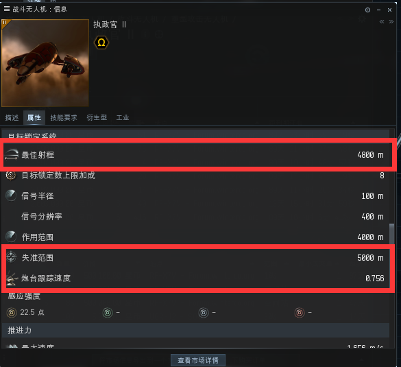

## 第三部分 防御系统

前言 讲完了武器系统，就该讲讲防御系统了。俗话说“活着才有输出”，因此防御系统的重要性无需多言，本文将从护盾、装甲、结构三个方面来详细讲解。

### 一、护盾

护盾是 M 族和 C 族舰船最常用的防御系统，也就是所谓的盾抗船。护盾的防御系统主要包括增加护盾值的护盾扩展装置、增加护盾抗性的护盾增强系统和护盾抗性增效器、以及增加护盾回复速度的护盾回充器、护盾回充增量器、护盾通量线圈以及护盾能源继电器。

护盾扩充装置俗称盾扩，这是护盾船只最主要的增加护盾总量的装备。这种装备安装后仅会导致舰船信号半径增大，而不会像装甲和结构的同类装备那样降低舰船的速度和机动性，**因此盾抗船拥有远超甲抗船的机动性**。

护盾增强系统和护盾抗性增效器均是用于增加护盾抗性的装备，但不同之处在于前者是主动装备，后者则是被动装备；前者抗性更高但是要耗电，后者不耗电但是抗性低；且只有护盾增强系统里才有增加所有抗性的适应性护盾增强器。这也就意味着一般情况下盾抗船都是选择使用护盾增强系统，也就是使用主动抗，而不是使用被动的护盾抗性增效器。而这也就导致了盾抗船最大的缺点——即非常耗电，**一旦被对方毁电，盾抗船的防御能力将会大幅度下降**。

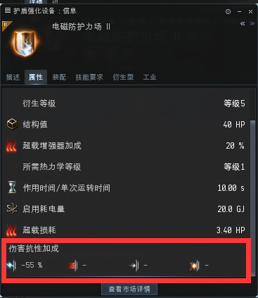

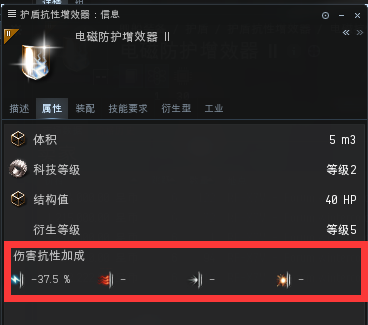

而用于护盾回冲的装备主要分为主动回盾和被动回盾。其中护盾回充器、护盾通量线圈以及护盾能源继电器属于增加舰船被动回盾的装备。但是护盾自身的回复速度并不快，即使使用装备加成也无法满足绝大部分时候的需要；而主动回盾装备——护盾回冲增量器，也就是俗称修盾的装备则不同，其通过消耗巨大的电量来快速回复护盾，无论是刷怪还是小队作战，其效果都非常优秀，因此是经常使用的回盾装备。

### 二、装甲

装甲一般是 G 和 A 族舰船上使用的防御系统，个别 M 族舰船也会使用甲抗配置。甲抗最大的优点就在于相较于护盾而言，更皮糙肉厚，当然机动性也要比盾抗船低。

装甲的防御类装备同样可以分为三大类，主要包括增加装甲量的电压式装甲附层、装甲附加板、附层装甲；增加装甲抗性的电压式附甲、抗性附甲、装甲增强器；以及回复装甲使用的装甲维修器。

对于增加装甲量的装备来说，装甲附加板是最常用的——因为他能够为舰船带来的装甲上限加成远超其他两种装备，因而几乎都是携带装甲附加板而非携带另外两种装备。

而对于抗性装备来说，电压式附甲拥有比抗性附甲更高的抗性甲成，且二者均为被动装备，因而电压式附甲的使用更为广泛；而装甲增强器作为主动装备，其针对性的抗性更高，**因此一般采用电压式附甲+装甲增强器的混合搭配来提升舰船的装甲抗性。**

至于装甲维修器则无需过多解释，是在没有后勤舰的情况下唯一的装甲回复方式。

### 三、结构

一般来说，很少会有以结构为主要防御的舰船，当然也有个别用来钓鱼装肉的船会这么干。但在这里要着重介绍一类装备：损伤控制。

损伤控制是一个放置在低槽的装备，每个舰船只能携带 1 个这种装备。它的唯一作用就是为你的护盾、装甲、结构增加抗性，其中对护盾的加成最低、装甲居中，而结构则是受到他加成最高的部分。

损伤控制分为三大类——普通的损控、突击损控以及旗舰损控。普通的损控就是一个被动装备，安装后就会对你的舰船起效；而突击损控和旗舰损控均为主动装备。突击损控在平时可以为你的舰船提供一定的护盾、装甲以及结构抗性加成，**但是当你启用时，突击损控能够在短时间内极大幅度提高你的护盾、装甲以及结构的抗性**，因而是非常好用的保命神器，不过这种损控制只能装备在突击护卫舰和重型突击巡洋舰上；而旗舰损控则是平时不提供任何加成，但是当你启用时，你的旗舰将会得到结构抗性的巨额加成，相当于短时间无敌，**但是使用后装备就会损毁**，很多旗舰会携带这种装备以备紧急时刻使用。

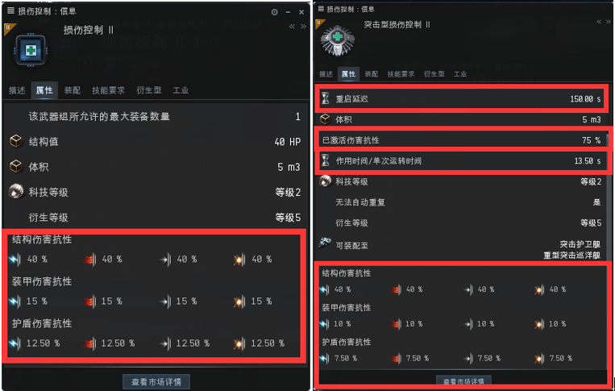

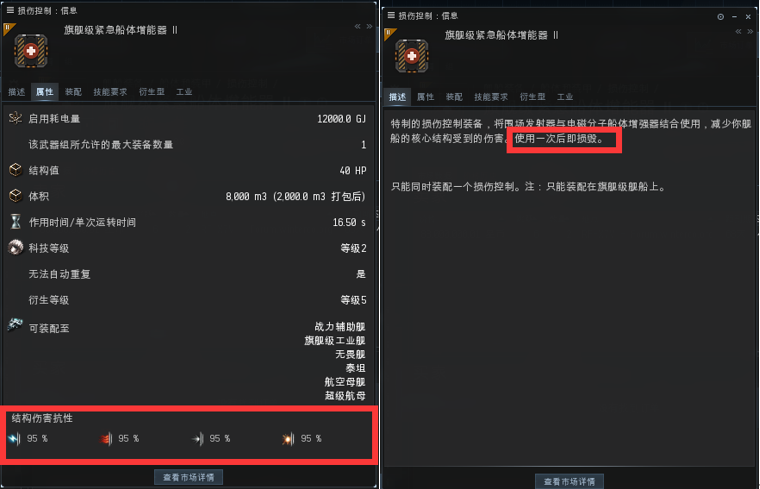

## 第四部分 舰船配装

### 前言

前面我们已经系统性地讲解了舰船上武器系统、防御系统以及舰船本身的特点。那么最后这一部分就是萌新们最关心的配船的相关内容了。为了让大家自己去理解如何配船而不是简单地照抄，加之联盟频道以及 SEAT 网站上都有常用舰船的配装，因此本文不会介绍具体船只的具体配装，只会告诉大家如何去配，这样即便是版本调整导致某些船的属性调整了，你也能第一时间自己调整配装，而不是等着其他大佬给你配一个。

### 一、装备名称与属性的关系

在开始配船之前，很多人应该会有一个疑问：同一种装备为什么有各种各样的不同型号，他们的区别是什么？其实同种装备的不同衍生型号的区别，就在装备的名字上有所体现。

首先来说武器和维修类装备（修盾、修甲、结构维修），他们的 T1 型号一般都分为 4 种型号，分别是衍生 1（Y1）到衍生 4（Y4），其中 Y1 的装备就是这种装备的基础型，没有任何的其他特点。对于所有的武器以及维修类装备来说，Y4 的装备伤害最高（维修量最高），因此是优先考虑的对象。

而对于其他装备来说，衍生型的差别主要在于其他方面而不是装备的主属性上。**一般来说名称上带有“紧凑型”的，意味着这件装备相较于同类的其他 T1 装备来说，所需要的 CPU 和能量栅格最少；名称上带有“抑制型”的装备，则意味着他的副作用是相对最低的；名称上带有“持久型”的，意味着他的耗电量是相对最低的；而名称上带有“视野型”的，则表示他的作用距离是相对最远的。**

### 二、有效抗的配船思路

所谓的有效是指当你打开所有主动装备时，你的舰船能够承受的伤害上限即为有效值（默认按照受到的伤害为电热动爆各占比 25%来进行计算）。这种配船的优点就在于，一般情况下不需要太考虑耗电的问题，也就是**没必要保证舰船永动**。而且，有效抗的舰船在作战时如果有后勤舰的话能最大程度发挥舰船的防御能力，因此几乎所有的会战船只均采用有效抗。

一般来说，我们有效抗的配船思路都是盾扩（装甲附加板）+全抗（电压式附甲）的方式，按照盾扩：全抗=1：1 的配置进行配船，如果还有槽位富余就会再增加 1 到 2 个针对抗。当然，部分情况下会根据舰船的特性来进行调整：比如 C 族重突希尔博拉斯的热、动、爆抗性天生就很高，但是电抗是 0，因此我们采用的抗性装备一般是 1 个全抗+1 个电抗，而非 2 个全抗。

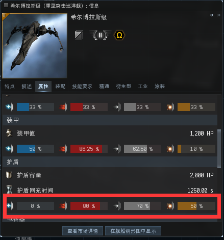

在不考虑其他因素（例如舰船跃迁速度、CPU 和能量栅格）的情况下改装件的选择一般采用的是 **3 个三角装甲聚合器（甲抗）或者 3 个核心防御力场扩张装置（盾抗）**，以便于最大程度增加舰船的有效值。

### 三、修量抗的配船思路

修量抗的配船思路与有效抗相反：即通过较高的抗性以及修量来使对方无法破防。这种配置基本上都是针对具有修量加成的船才会这么配。不过这样配的好处就在于：对方如果火力不足的话是不可能打死你的，最起码也是一时半会之内打不死你，所以主要是用于小队战或者单浪这种没有后勤或者后勤非常少的情况下使用，其搭配方式就是 1~2 个修盾（修甲）装备搭配大量的全抗以及针对抗。这里要注意：**修量抗是不带盾扩或者装甲附加板的！**其原因非常简单：假设你的船只修量为每秒 100 点，抗性为 0，此时对方的伤害为每秒 200 点，那么你装备盾扩或者装甲附加板只能拖延你的死亡时间；但是如果你将抗性变为 60%，修量不变，那么对方的伤害将变为原来的 40%，也就是 80 点，这样一来对方的火力低于你的修量，也就是说只要你还有电，对方就永远也不可能打死你。

修量抗由于盾抗和甲抗存在巨大差异，因此这里分开来讲解。

首先是盾抗。盾抗船的修量抗一般采用的不是自修，而是采用注盾——也就是辅助护盾回充增量器。普通的修盾装备需要消耗大量的电容，而注盾最大的特点就在于他可以完全通过直接消耗电池的方式来回复护盾。也就是说你没必要带个修盾然后再带个注电器，或者是想尽办法让电容可以多撑一会，你只需要在船舱里带够电池，只要电池没吃完你就能一直修；而且，注盾与注电不同之处在于：注电器需要使用能够装载的最大体积的电池才能保证注电的效果，而注盾则是不管什么体积的电池，每个电池带来的修量是相同的！**也就是说注电需要用最大的，而注盾则是用最小的电池。**一般我们会装备更高一级的注盾，并且有时会携带多个注盾，同时改装件也会装配提升抗性的船插（哪个抗性低就上哪个的船插），以此来保证舰船属性的最优化。

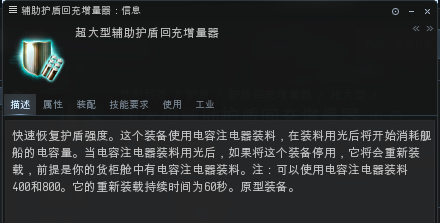

而甲抗的修量抗与盾抗类似，同样存在一个名为辅助装甲维修器的装备，他可以通过消耗纳米体修复粘合剂来降低该装备启用时的耗电量（注意是降低，他和注盾不一样，注盾用电池是不耗电的，但是注甲无论如何都会耗电，只是多少的区别而已），由于这种装备只能携带一个，所以**一般修甲的舰船都是采用 1 个注甲+1 个自修的配置**，同时搭配中槽的注电器（装甲装备都在低槽，中槽非常富余）改装件上的纳米机器人加速器和辅助纳米聚合器（增加修量并缩短每次修复的间隔），以此来保证你的修量。这种时候决定你能抗多久的仍然是你包里的电池，只不过这时候你包里应该携带的都是你的注电器能够使用的最大规格的电池。

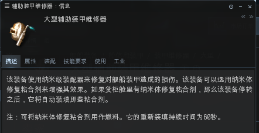

### 四、速度抗、火力抗、距离抗以及结构抗

之前所提到的有效抗和修量抗是最最常用的配船思路。但是 EVE 当中还存在其他一些思路，由于这些配船思路一般对驾驶员的操作水平要求很高，或者是应用场合比较苛刻，因此只做一个简单的介绍。

速度抗：这种一般都是护卫舰级别的船采用的配船思路——通过高速环绕，降低被对方命中的概率以及降低导弹对自身的伤害，以此来达到保护自己的目的。但是这种思路最怕的就是近距离的扰频（无法开启微曲）、网子（降低舰船速度）以及毁电（没电你还想往哪跑？），加之这种船一旦被打中很可能就是被一发入魂，因此对于操作要求非常高。

火力抗：这种是一些 PVP 大佬才会采用的配船思路——通过超高的火力在短时间内把对面核心舰船打死，以此来降低自己受到的伤害（把你们都杀了就没人打我了.jpg），同样非常不建议萌新使用。

距离抗：这种思路一般见于龙卷风级、乌鸦级之类的远炮战舰，通过超远的锁定距离和射程，让对面无计可施。通常情况下需要有人帮你在前面抗着，而且需要你提前做好朝向以及安全点，以便于即将被近身时赶紧跑路。

结构抗：这种一般是装肉的船才会这么干，当对方把你的护盾和装甲都给打没之后才发现你是结构抗，这个时候即使是战列舰也早已经完成了对敌方的锁定，对方已经没有可能跑路了，而此时的你才刚开始正式抗伤害，那么结果可想而知。所以这种配置如果不是装肉的，一般很少有人会用。

### 五、其他装备的选择

除了武器和防装之外，一般来说舰船还需要装备一些其他装备——包括武器升级、推进器改良、工程学改良等等。这里给大家简单的介绍一下。

* 武器升级

武器升级主要是指增加武器伤害、射程、跟踪速度（降低导弹爆炸半径）的装备。

在武器升级装备的大类中，弹道控制系统（导弹）、散热槽（能量炮）、回转稳定器（射弹炮）、磁性立场稳定器（混合炮）、熵辐射槽（熵能分解者）、无人机伤害增效装置（无人机）分别用于增加对应武器系统的伤害。

索敌计算机（炮类）、索敌链接（无人机）以及导弹导引计算机（导弹）均为中槽可以加装脚本的装备，其作用就是增加武器或者无人机的射程和跟踪速度（对导弹来说就是射程和爆炸半径）。

而索敌增强器、全方位索敌增强器以及导弹导引增强器的效果同上，只不过他们是低槽的被动装备且无法用脚本进行特定属性的加强。

* 推进器改良

推进器改良主要包括超载喷注器、跃迁加速装置、惯性稳定器、跃迁稳定器、跳跃节能装置以及纳米纤维内部框架。

其中，超载喷注器和跃迁加速器分别可以增加舰船的航行速度和跃迁速度；跃迁稳定器可以增加对抗跃迁扰断或者跃迁扰频的能力；惯性稳定器（俗称皮球）则能够增加舰船转向速度并缩短起跳时间（即提高机动性）；跳跃节能装置能降低跃迁的电容消耗，而纳米纤维内部框架（俗称方块）则可以增加舰船航行速度并同时增加舰船机动性。

一般来说，如果需要高速战舰，一般采用的装备就是超载喷注器、惯性稳定器以及纳米纤维内部框架，具体的搭配根据情况而定。

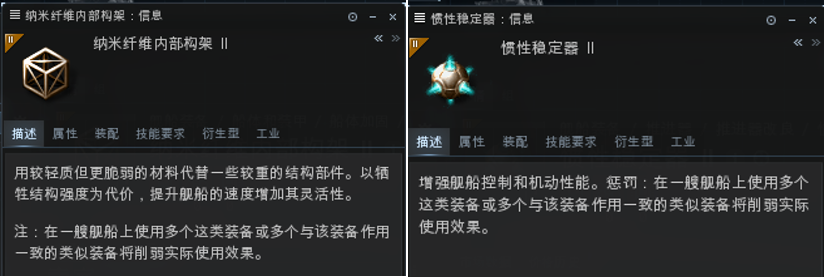

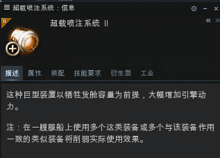

* 工程学改良

很多萌新刚开始配船的时候最容易碰见的问题就是——CPU 或者能量栅格不够用。这种时候一般我们除了之前所讲的采用紧凑型装备外，最好的办法就是通过工程学改良装备来弥补。工程学改良装备主要包括能源诊断系统、辅助能量控制、反应堆控制单元以及 CPU 升级模块。

能源诊断装备通过消耗 CPU，可增加能量格栅的大小，并提高电容和护盾上限以及回充速度。

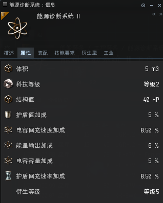

辅助能量控制与反应堆控制单元均是通过消耗 CPU 来提高能量格栅的大小，但是二者的区别在于辅助能量控制是增加一个固定的值，而反应堆控制单元则是根据舰船自身能量格栅的大小按百分比增加。

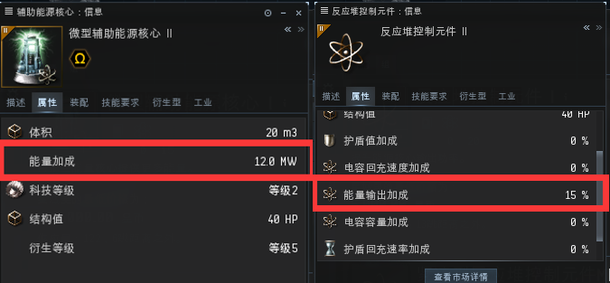

CPU 升级模块则是直截了当的通过消耗 1 点能量栅格来增加舰船的 CPU 大小。

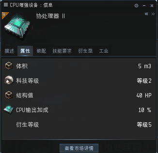

