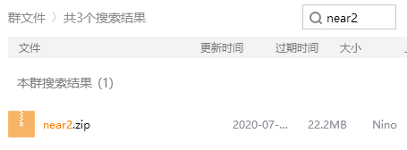
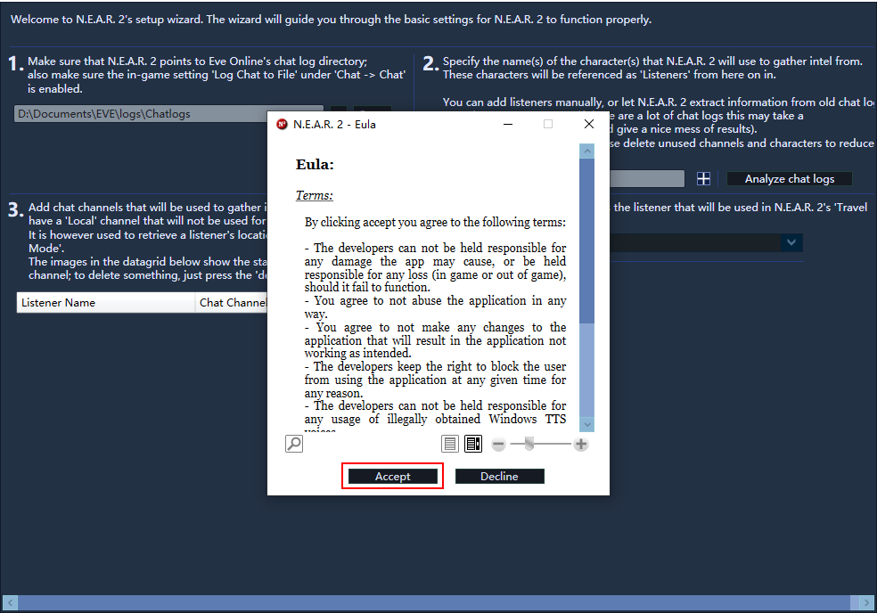
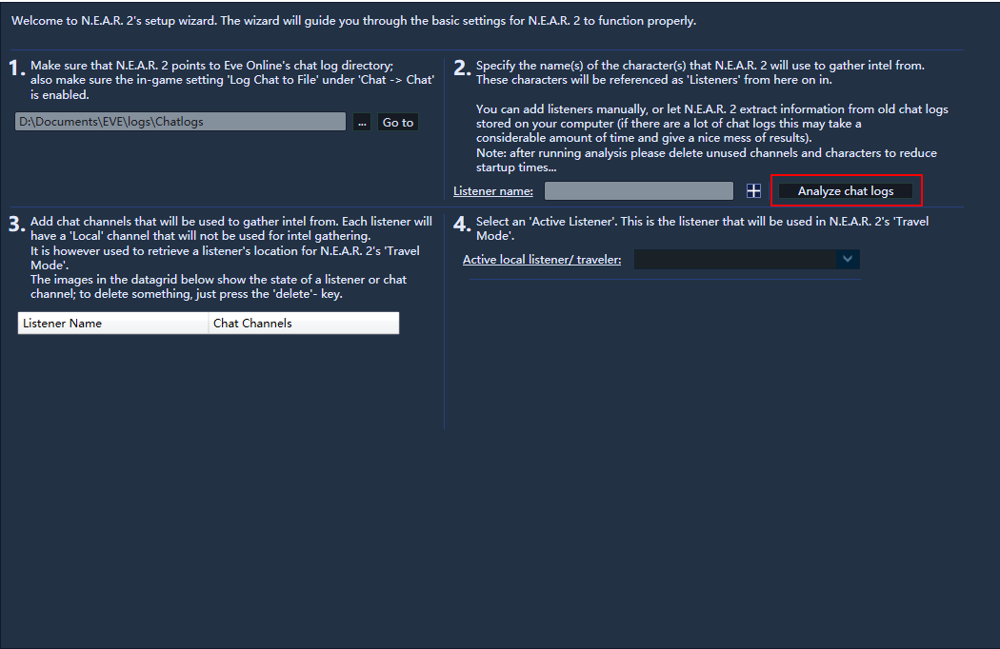
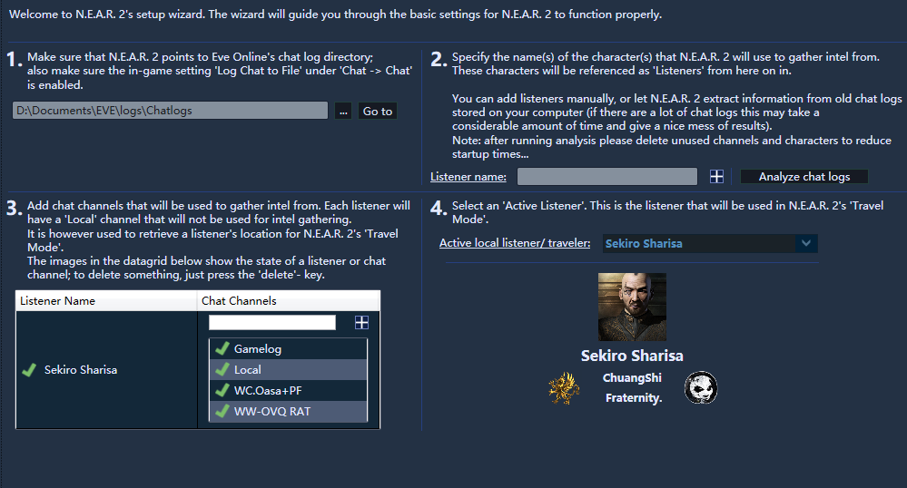
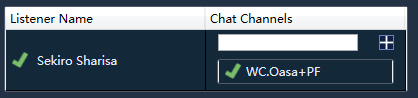
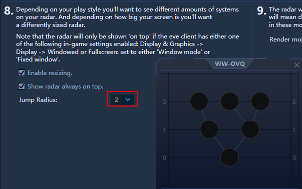
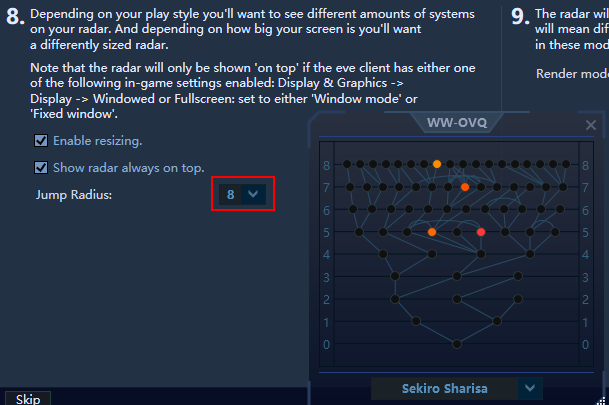
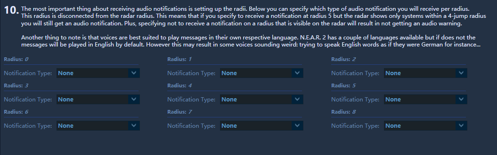
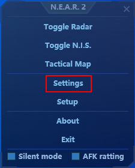
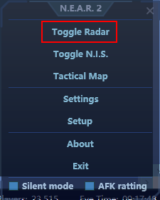

# Near2 预警设置

## 设置

* 在群文件中下载near2 并解压



* 打开后，选择接受

* 点击 `analyze chat log` 他将会自动读取聊天日志

* 选择不需要的频道或角色，按下键盘上的 `del` 即可删除，留下预警频道即可

* 下一步
* 这里没事需要设置的地方，但要了解的是，第8部分可以设置雷达显示的跳数

* 下一步
* 这里根据自己喜好设置预警声音

* 下一步，完成
* 右键near2后台，点击`setting` 

* 来到`N.I.S`页面，将`Enable clipboard monitoring` 取消勾选，不然每当你复制东西时，都将会弹出一个窗口
* 右键near2后台，点击radar 打开雷达窗口

这就是可以告诉你敌对位置的窗口

## 雷达位置不跟随或不显示 解决方法

1. 关闭汉化，启动英文客户端
2. near2检测到正确位置后，将客户端语言改为日文
3. 开启汉化，启动游戏

